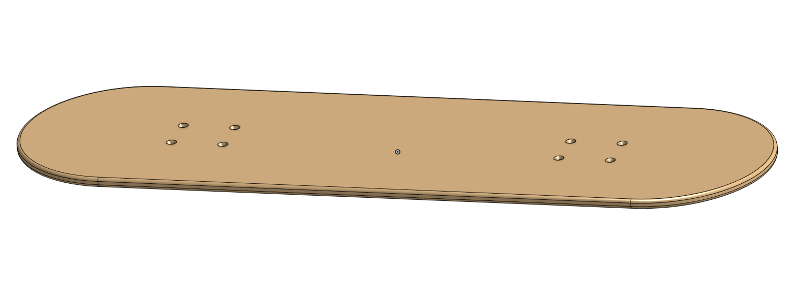
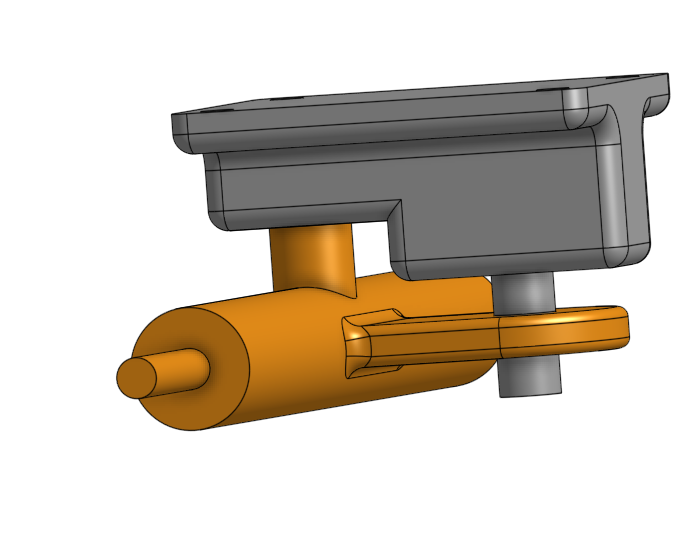
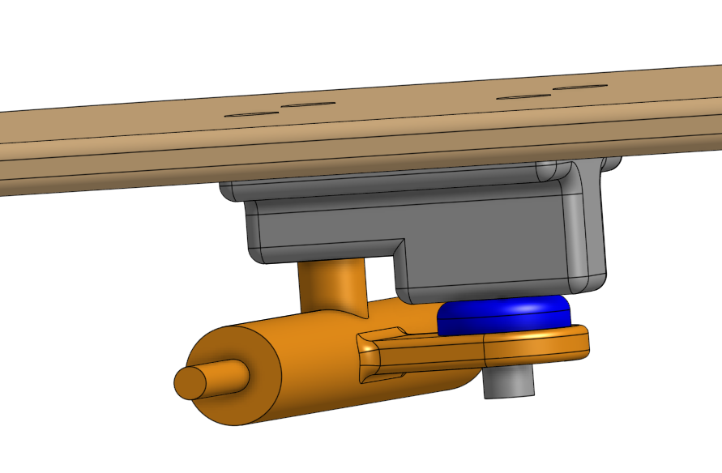
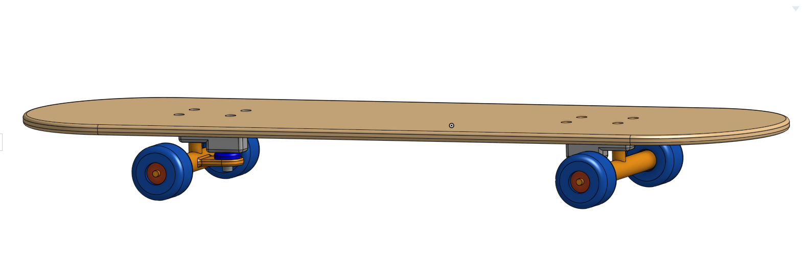

# skateboard

## Table of Contents
* [Deck](#Deck)
* [Trucks](#Trucks)
* [Bushing](#Bushing)
* [Wheel and Bearing](#Wheel_and_Bearing)
* [Skateboard](#Skateboard)
---

## Deck 

### Evidence

### Reflection
This was the basis for the skateboard, so it had to be perfect. I learned that addressing fillets and making sure every measurement was correct and in the right spot made a big difference in how the deck turned out. 

## Trucks 

### Evidence

### Reflection
The trucks were pretty straight forward to do, but I learned through a mistake that you have to make sure that you are adding or cretaing a new part when you extrude. It's an easy thing to overlook, but if you forget to add and create a new part, or vise versa, then later on you could have problems and have to go back and fix it. 

## Bushing 

### Evidence

### Reflection
The bushing didn't give me any issues, except that I forgot to make the hole in the truck hanger so later on the kingpin was just existing through the truck hanger instead of passing through the bushing and the truck hanger's hole. 

## Wheel_and_Bearing

### Evidence

### Reflection
The revolve tool made creating the wheel super fast and efficient. When you use revolve, it leaves little room for error compared to using the extrude tool. The bearing fits right in, and a few small extrude removes later, I was moving on.

## Skateboard

### Evidence

### Reflection
Putting everything together was a fun process, I expected it to take much longer then it did which was great. Having each part be a different color makes it much less confusing when it comes time to having everything in one part assembly and mating things to join. Each part built off of another, so the skateboard seemed to flow smoothly. Using Replicate, having a single nut or bolt that was already placed in it's spot allowed me to place many more in within a second. That tool saved me so much time, because when I did the bolts originally, I didn't use the replicate tool since I hadn't seen it yet. I went back and did it again but with the Replicate tool, and it was so much faster and I used it for all of the nuts too. 

